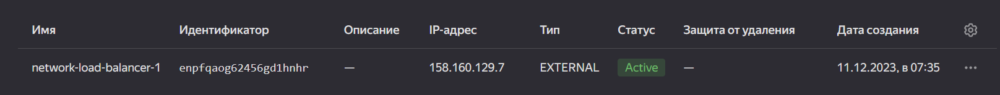
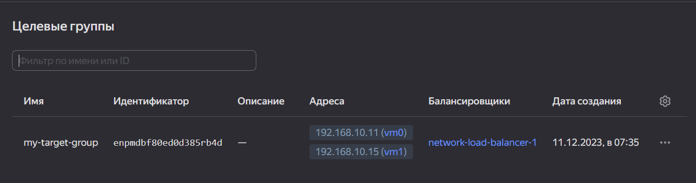

 # Отказоустойчивость в облаке - Илларионов Дмитрий
 
 ---

## Задание 1 

Возьмите за основу [решение к заданию 1 из занятия «Подъём инфраструктуры в Яндекс Облаке»](https://github.com/netology-code/sdvps-homeworks/blob/main/7-03.md#задание-1).

1. Теперь вместо одной виртуальной машины сделайте terraform playbook, который:

- создаст 2 идентичные виртуальные машины. Используйте аргумент [count](https://www.terraform.io/docs/language/meta-arguments/count.html) для создания таких ресурсов;

Создал:
```
resource "yandex_compute_instance" "vm" {
  count=2
  name                      = "vm${count.index}"
#...
output "app_external-ip" {
   value="${yandex_compute_instance.vm[*].network_interface.0.nat_ip_address}"
}

```
См. файлы terraform (там были обновления)

- создаст [таргет-группу](https://registry.terraform.io/providers/yandex-cloud/yandex/latest/docs/resources/lb_target_group). Поместите в неё созданные на шаге 1 виртуальные машины;

Создал и поместил ip адреса машин:

```

#-------- создание целевой группы -------

resource "yandex_lb_target_group" "my-target-group-resource" {
  name      = "my-target-group"
  region_id = "ru-central1"

  target {
    subnet_id = "${yandex_vpc_subnet.subnet-1.id}"
    address   = "${yandex_compute_instance.vm[0].network_interface.0.ip_address}"
  }

  target {
    subnet_id = "${yandex_vpc_subnet.subnet-1.id}"
    address   = "${yandex_compute_instance.vm[1].network_interface.0.ip_address}"
  }
}
```
Или еще вариант:

```
#-------- создание целевой группы -------

resource "yandex_lb_target_group" "my-target-group-resource" {
  name      = "my-target-group"
  region_id = "ru-central1"

  dynamic "target" {
    for_each = yandex_compute_instance.vm
    content {
      subnet_id = yandex_vpc_subnet.subnet-1.id
      address   = target.value.network_interface[0].ip_address
    }
  }
}
```

- создаст [сетевой балансировщик нагрузки](https://registry.terraform.io/providers/yandex-cloud/yandex/latest/docs/resources/lb_network_load_balancer), который слушает на порту 80, отправляет трафик на порт 80 виртуальных машин и http healthcheck на порт 80 виртуальных машин.

Создал:

```
resource "yandex_lb_network_load_balancer" "lb-1" {
  name = "network-load-balancer-1"

  listener {
    name = "network-load-balancer-1-listener"
    port = 80
    external_address_spec {
      ip_version = "ipv4"
    }
  }

  attached_target_group {
    target_group_id = yandex_lb_target_group.my-target-group-resource.id

    healthcheck {
      name = "http"
      http_options {
        port = 80
        path = "/"
      }
    }
  }
}
```

Рекомендуем изучить [документацию сетевого балансировщика нагрузки](https://cloud.yandex.ru/docs/network-load-balancer/quickstart) для того, чтобы было понятно, что вы сделали.

2. Установите на созданные виртуальные машины пакет Nginx любым удобным способом и запустите Nginx веб-сервер на порту 80.

Установил, на разных ВМ скорректировал дефолтную страницу nginx - добавил "1" и "2" что бы проверить что балансировщик работает корректно.


3. Перейдите в веб-консоль Yandex Cloud и убедитесь, что: 

- созданный балансировщик находится в статусе Active,



- обе виртуальные машины в целевой группе находятся в состоянии healthy.


4. Сделайте запрос на 80 порт на внешний IP-адрес балансировщика и убедитесь, что вы получаете ответ в виде дефолтной страницы Nginx.


*В качестве результата пришлите:*

*1. Terraform Playbook.*

См. файлы terraform - там были уже свежие обновления.
Или прошлая версия:

```
terraform {
  required_providers {
    yandex = {
      source = "yandex-cloud/yandex"
    }
  }
  required_version = ">= 0.13"
}

locals {
  zone = "ru-central1-a"
}

provider "yandex" {
  token = "**********"
  cloud_id = "******"
  folder_id = "b1g6k2i3lobiesnh55af"
  zone = local.zone
}

#---- vm-1 --------------

resource "yandex_compute_instance" "vm" {
  
  count=2
  name                      = "vm${count.index}"
  allow_stopping_for_update = true
  platform_id               = "standard-v1"
  zone                      = local.zone

  resources {
    core_fraction = 5
    cores  = "2"
    memory = "2"
  }

  boot_disk {
    initialize_params {
      image_id = "fd82nvvtllmimo92uoul"   #ubuntu
    }
  }

  network_interface {
    subnet_id = "${yandex_vpc_subnet.subnet-1.id}"
    nat       = true
  }

  scheduling_policy {
  preemptible = true
   }

#  metadata = {
#    ssh-keys = "<имя_пользователя>:<содержимое_SSH-ключа>"
#  }
 metadata = {
    user-data = "${file("./meta.yaml")}"
  }

}

#---- Создани подсети нужна одна на все ВМ --------------

resource "yandex_vpc_network" "network-1" {
  name = "network1"
}

resource "yandex_vpc_subnet" "subnet-1" {
  name           = "subnet1"
#  zone           = "<зона_доступности>"
  v4_cidr_blocks = ["192.168.10.0/24"]
  network_id     = "${yandex_vpc_network.network-1.id}"
}


#-------- создание целевой группы -------

resource "yandex_lb_target_group" "my-target-group-resource" {
  name      = "my-target-group"
  region_id = "ru-central1"

  target {
    subnet_id = "${yandex_vpc_subnet.subnet-1.id}"
    address   = "${yandex_compute_instance.vm[0].network_interface.0.ip_address}"
  }

  target {
    subnet_id = "${yandex_vpc_subnet.subnet-1.id}"
    address   = "${yandex_compute_instance.vm[1].network_interface.0.ip_address}"
  }

}


resource "yandex_lb_network_load_balancer" "lb-1" {
  name = "network-load-balancer-1"

  listener {
    name = "network-load-balancer-1-listener"
    port = 80
    external_address_spec {
      ip_version = "ipv4"
    }
  }

  attached_target_group {
    target_group_id = yandex_lb_target_group.my-target-group-resource.id

    healthcheck {
      name = "http"
      http_options {
        port = 80
        path = "/"
      }
    }
  }
}

output "external_ip_address_lb" {
  value = [
    for listener in yandex_lb_network_load_balancer.lb-1.listener :
    listener.external_address_spec
  ]
}

```


*2. Скриншот статуса балансировщика и целевой группы.*




*3. Скриншот страницы, которая открылась при запросе IP-адреса балансировщика.*


---

## Задания со звёздочкой*
Эти задания дополнительные. Выполнять их не обязательно. На зачёт это не повлияет. Вы можете их выполнить, если хотите глубже разобраться в материале.

---

## Задание 2*

1. Теперь вместо создания виртуальных машин создайте [группу виртуальных машин с балансировщиком нагрузки](https://cloud.yandex.ru/docs/compute/operations/instance-groups/create-with-balancer).

2. Nginx нужно будет поставить тоже автоматизированно. Для этого вам нужно будет подложить файл установки Nginx в user-data-ключ [метадаты](https://cloud.yandex.ru/docs/compute/concepts/vm-metadata) виртуальной машины.

- [Пример файла установки Nginx](https://github.com/nar3k/yc-public-tasks/blob/master/terraform/metadata.yaml).
- [Как подставлять файл в метадату виртуальной машины.](https://github.com/nar3k/yc-public-tasks/blob/a6c50a5e1d82f27e6d7f3897972adb872299f14a/terraform/main.tf#L38)

3. Перейдите в веб-консоль Yandex Cloud и убедитесь, что: 

- созданный балансировщик находится в статусе Active,
- обе виртуальные машины в целевой группе находятся в состоянии healthy.

4. Сделайте запрос на 80 порт на внешний IP-адрес балансировщика и убедитесь, что вы получаете ответ в виде дефолтной страницы Nginx.

*В качестве результата пришлите*

*1. Terraform Playbook.*

```
variable env_prefix {}
variable hostname_blocks {}

#variable vpc_cidr_block {}
#variable avail_zone {}
#variable instance_ip {}
#variable ipaddr_blocks {}

data "template_file" "metadata" {
  template = file("./meta.yaml")
}

#--- Группа ВМ с балансировщиком ---


resource "yandex_compute_instance_group" "ig-1" {
  name                = "fixed-ig-with-balancer"
  folder_id           = "b1g6k2i3lobiesnh55af"
  service_account_id  = "aje2271kkvefi1el32vv"
  #deletion_protection = "<защита_от_удаления:_true_или_false>"
  instance_template {
    platform_id = "standard-v1"
    resources {
      memory = 2
      cores  = 2
    }

    boot_disk {
      mode = "READ_WRITE"
      initialize_params {
        image_id = "fd82nvvtllmimo92uoul"
      }
    }

    network_interface {
      network_id = "${yandex_vpc_network.network-1.id}"
      subnet_ids = ["${yandex_vpc_subnet.subnet-1.id}"]
      nat       = true
    }

#    metadata = {
#      user-data = "${file("./meta.yaml")}"
#    }
    metadata = {
      user-data = data.template_file.metadata.rendered
    }  

    scheduling_policy {
      preemptible = true
    }
  }
  scale_policy {
    fixed_scale {
      size = 2
    }
  }

  allocation_policy {
    zones = ["ru-central1-a"]
  }

  deploy_policy {
    max_unavailable = 1
    max_expansion   = 0
  }

  load_balancer {
    target_group_name        = "target-group"
    target_group_description = "load balancer target group"
  }
}


#-- создание балансировщика ----

resource "yandex_lb_network_load_balancer" "lb-1" {
  name = "network-load-balancer-1"

  listener {
    name = "network-load-balancer-1-listener"
    port = 80
    external_address_spec {
      ip_version = "ipv4"
    }
  }

  attached_target_group {
    target_group_id = yandex_compute_instance_group.ig-1.load_balancer.0.target_group_id

    healthcheck {
      name = "http"
      http_options {
        port = 80
        path = "/"
      }
    }
  }
}

output "external_ip_address_lb" {
  value = [
    for listener in yandex_lb_network_load_balancer.lb-1.listener :
    listener.external_address_spec
  ]
}

output "external_ip_addresses" {
  value = yandex_compute_instance_group.ig-1.instances.*.network_interface.0.nat_ip_address
}

output "internal_ip_addresses" {
  value = yandex_compute_instance_group.ig-1.instances.*.network_interface.0.ip_address
}
```

Файл мета:
```
#cloud-config
users:
 - name: dmil
   groups: sudo
   shell: /bin/bash
   sudo: ['ALL=(ALL) NOPASSWD:ALL']
   ssh-authorized-keys:
     - ssh-ed25519 AAAAC3NzaC1lZDI1NTE5AAAAIHgAWJRB1phor3yFZd/GZBaVIZUzYc8KyrpSzQnEH7lJ user@worknout

timezone: Europe/Moscow
package_update: true
package_upgrade: true
#repo_update: true
#repo_upgrade: true

apt:
  preserve_sources_list: true
packages:
  - nginx
runcmd:
  - [ systemctl, nginx-reload ]
  - [ systemctl, enable, nginx.service ]
  - [ systemctl, start, --no-block, nginx.service ]
  - [ sh, -c, "echo $(hostname | cut -d '.' -f 1 ) > /var/www/html/index.html" ]
  
```


*2. Скриншот статуса балансировщика и целевой группы.*


*3. Скриншот страницы, которая открылась при запросе IP-адреса балансировщика.*

